> I'm a 2026 CS graduate actively shipping production-grade AI/ML systems — targeting **AI Engineer / ML Engineer** roles in Chennai & Bengaluru.
>
> - [x] [`SafeGuard`](https://github.com/Ahamed-h/SafeGuard_Industrial-PPE-Detection-Using-YOLOv8) — Real-time PPE detection for construction sites · YOLOv8 · FastAPI · OpenCV · violation logging
> - [x] [`DocMind`](https://github.com/Ahamed-h/Docmind) — Production RAG system · FAISS + BM25 hybrid search · Cross-encoder reranking · Gemini 2.0 Flash · LLM-as-judge hallucination detector · Streamlit
> - [x] [`LectureLens AI`](https://github.com/Ahamed-h/lecturelens-Ai) — AI podcast Q&A with YouTube timestamp seeking · FastAPI · ChromaDB · Gemini · React/Vite · Docker 
>
> *Open to full-time opportunities — feel free to reach out!*

---

**Tech I work\am learning with:**
`Python` `YOLOv8` `FastAPI` `LangChain` `FAISS`  `Gemini` `HuggingFace` `React` `Docker` `Streamlit`

---

Profile metrics generated using [lowlighter/metrics](https://github.com/lowlighter/metrics)
